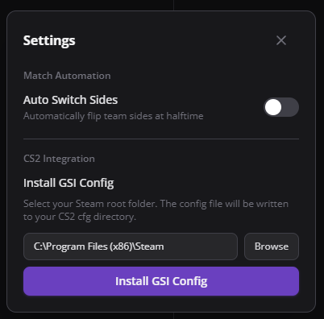
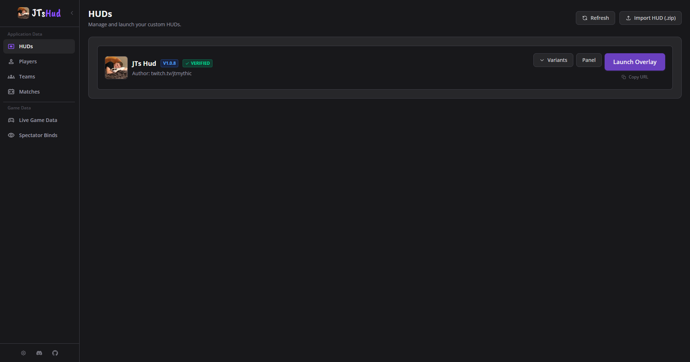
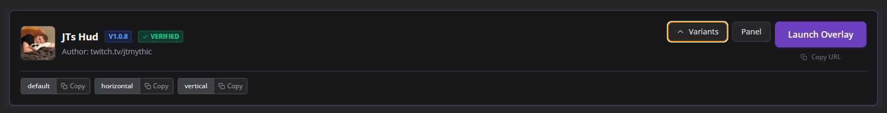
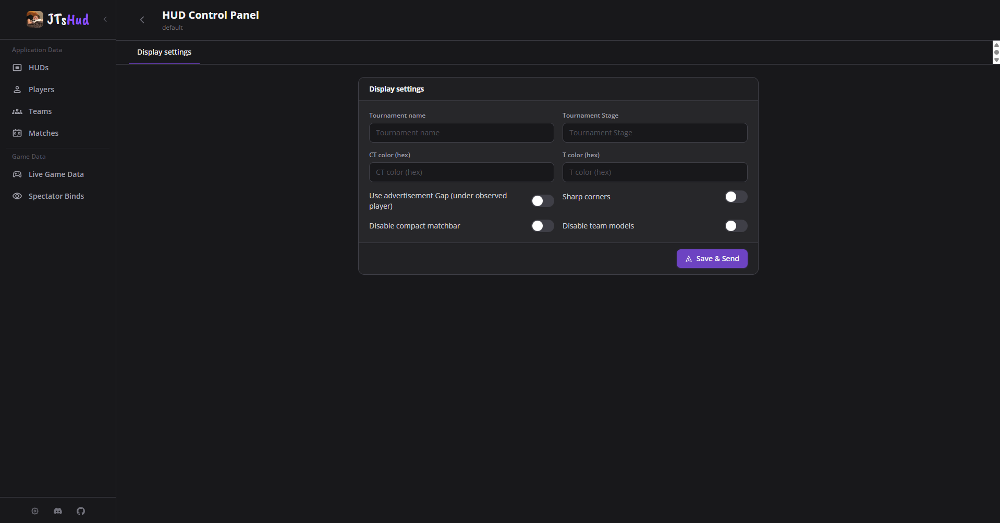
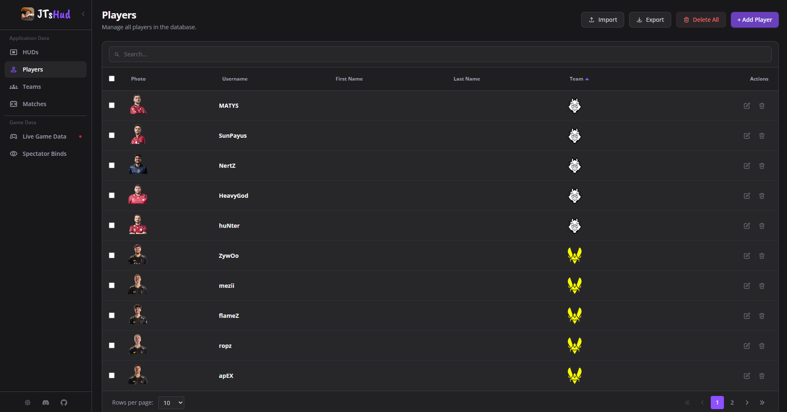
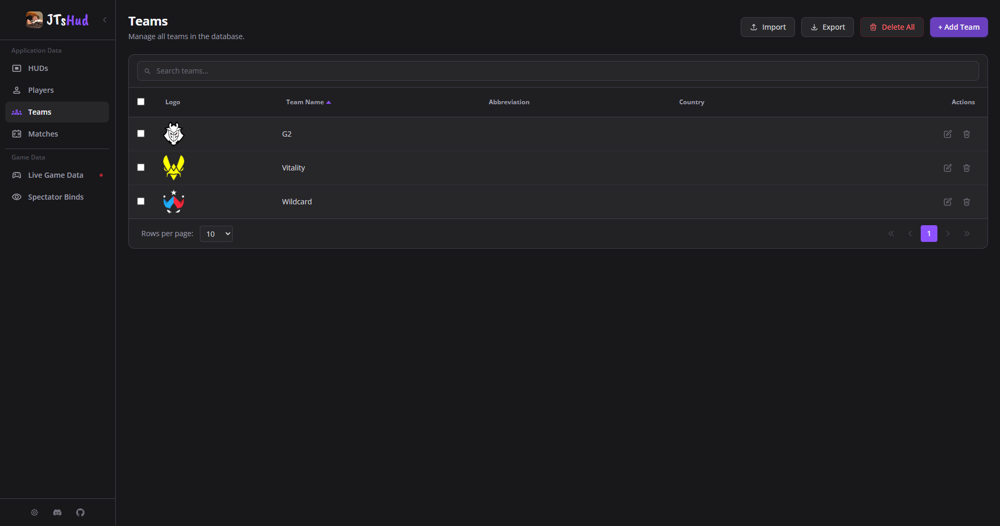
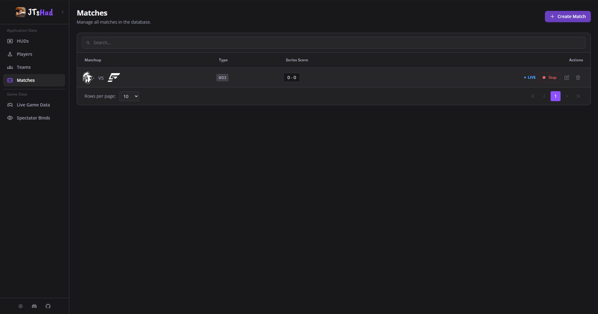
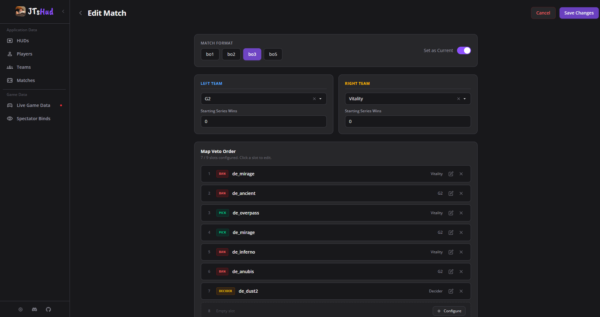
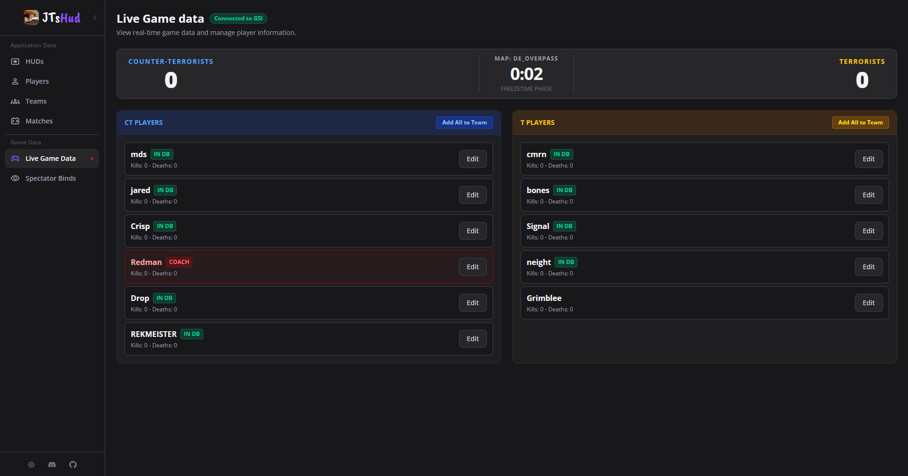
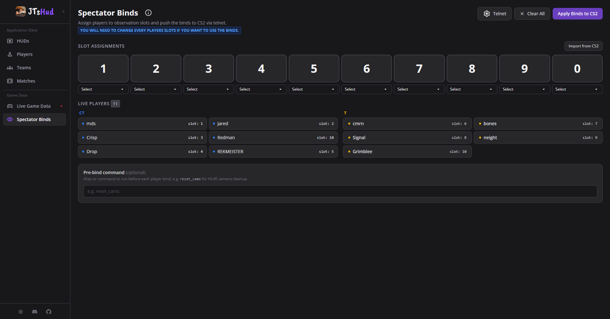

# TD Hud Manager (Formally OpenHud)

A simple open-source Counter-Strike 2 Custom Hud and Hud manager. Manage overlays, players, teams, and matches. This project is passively updated, and community PRs are much appreciated!

- Tech: Electron, Vue, Typescript, NodeJS/Express, Socketio, SQLite3

_Disclaimer: A small portion of this is ai generated, and while I don't entirely love the idea of vibe coding, it helped in areas that I struggled to understand. I have tried to comment the places that were generated and that could lead to some bugs_


---

## Features

- **Built-in default HUD**
- **Bring Your Own HUD (BYOH)** - import any HUD compatible with the [cs2-react-hud](https://github.com/lexogrine/cs2-react-hud)
- **Player & team management**
- **Match management**
- **Keybinds**
- **Live view** - see the current CS2 game states and manage players mid-match
- **Spectator Binds tool** - Visually reorder and rebind observer slots, helps when hiding coaches from the overlay

---

## Installation

1. Download the latest unpacked version or `.exe` installer from the [Releases](../../releases/latest) page.

_Note: While the releases are for windows, electron builder does allow for linux and mac if needed_

---

## CS2 Game State Integration Setup

The hud manager reads live data from CS2 via the Game State Integration (GSI) cfg. The config file can be installed automatically via the settings menu.

1. Click the **Settings** icon in the sidebar.
2. Select your **Steam directory** (the folder where Steam is installed, e.g. `C:\Program Files (x86)\Steam`).
3. Click **Install GSI**.

The hud manager will write the required config file into your CS2 installation automatically. Restart CS2 if it was already running, and the **Live** view will begin receiving game state data.



---

## Using the HUD

### Launching the default HUD

1. Open the **HUDs** tab.
2. Find **TD Hud** and click **Launch**. This launches the main/default variant of the HUD
3. Press **Copy URL** button to copy the overlay URL and paste it into your broadcasting software (OBS, vMix, etc.) as a **Browser Source**.



### HUD variants

The default HUD ships with multiple layout variants (e.g. `default`, `horizontal`, `vertical`). Expand the HUD card to see all available variants and launch the one that fits your production layout.



### Panel controls

Click **Panel** on any HUD to open the live settings panel. In the default hud's panel you can **change team colors** along with other visual options shown in the image below



---

## Keybinds

### Global App Shortcuts

These shortcuts are always active while the hud manager is running, regardless of which HUD is open.

| Shortcut | Action                                                            |
| -------- | ----------------------------------------------------------------- |
| `Alt+F`  | Force-refresh all connected HUD overlays                          |
| `Alt+R`  | Toggle reverse sides for the current map in the active match veto |

### Default HUD Keybinds

When **TD Hud** overlay is open, the following additional shortcuts become active:

| Shortcut | Action                |
| -------- | --------------------- |
| `Alt+V`  | Increase radar size   |
| `Alt+B`  | Decrease radar size   |
| `Alt+O`  | Toggle Hud visibility |

These are registered automatically when the overlay launches and unregistered when it closes.

---

## Bring Your Own HUD

This hud managers supports any HUD built against the [lexogrine/cs2-react-hud](https://github.com/lexogrine/cs2-react-hud) open-source template. The majority of features from the template spec are integrated, including game state data, player/team enrichment, match data, and panel controls.

**_Signed custom huds are now supported to protect hud makers but could be buggy_**

> **Not currently supported:** Lexogrine-specific features including ScoutAI, camera controls, and killfeeds (some in the works) are not available.

### Importing a custom HUD

1. Package your HUD as a `.zip` file. The zip should contain the HUD files at its root (including a `hud.json` manifest).
2. Open the **HUDs** tab and click **Import HUD**.
3. Select your `.zip` — the HUD will be extracted and appear in the list.
4. Signed huds should attach a **Verified** badge to itself in the HUDs card.

---

## Managing Players, Teams & Matches

### Players

Go to **Players** to create and edit player profiles. Each player can have:

- First name, last name, username
- Steam ID (used to match live GSI data to your player profiles)
- Country, avatar image
- Team assignment
- Coach flag

You can also bulk-import player rosters from an Excel spreadsheet using the import feature on the Players page.



### Teams

Go to **Teams** to create teams with a name, short name, logo, and country.



### Matches

Go to **Matches** to create a match:

1. Assign a left team and right team.
2. Add veto data (map picks/bans and side selections).
3. Set the match as **Current Match** in the form or matches action column in the table.




---

### Live View

The **Live** tab shows the current CS2 game state in real time. When a match is running, all 10 players are displayed with their live stats. This makes it easy to quickly create players on the fly and assign them to a team without leaving the view. **I highly recommend downloading a teams demo, playing the demo, and using this menu to create players and teams** as steamids and alias will be automatically filled in.

1. Open the **Live** tab while in a demo/server.
2. Click **Add Player** next to any live player to pre-fill their profile from GSI data (username, Steam ID).
3. Assign them to a team directly from the creation form.



---

## Spectator Binds Tool

The **Spectator Binds** tool lets observers assign specific players to fixed observer slots (1–10) and push those binds directly to CS2 via its telnet interface.

**Why use it?**
This tool is very useful for two cases.

### Coaches & Observer Slot Corruption

Platforms like Faceit have to get creative when allowing coaches into a server along with their players as Valve has yet to integrate a coaching slot like we had in CSGO. They do it by allowing the coach to join the team in game and killing them at the start of every round. This sucks for us as this means coaches take up extra observer slots which leads to players having slots 11, 12, etc.

### Lans and Obervers

Normally, CS2 will swap sides of teams at half which includes what slots each player is. LANs do not have the ability to switch which side the players are on while on the stage, so we can manually keep teams on the left and right with this. An additional benifit is that it helps observers as the slots will not change so players keep the same slot throughout the entire match.

**I solved this in two ways:**

- **Mark a player as a coach**: Go to **Players**, edit the player, and enable the **Coach** flag. This filters them out from the data sent to the overlays, essentially hiding them.

- **Override slots manually**: Use the Spectator Binds tool to visually override each player to a specific observer slot, and use binds to swap to the correct slots.

This is a **VISUSAL** change, we are not actually modifying the game in anyway other than using binds.

### Setup

1. Launch CS2 with telnet enabled. Add the following to your CS2 launch options:
   ```
   -netconport 2020
   ```
2. Open **Spectator Binds** in the program and click the **Telnet** settings button.
3. Enter the host (`127.0.0.1`) and port (`2020`) and save.
4. Click **Test Connection** to verify.

### Using Spectator Binds

1. Click **Fill from CS2** to populate slots from the current live game state.
2. Drag players between slots or use **Quick Assign** to assign an entire side at once.
3. Click **Apply Binds**: The hud manager sends the `bind` commands to CS2 via telnet automatically.
4. Use **Clear Binds** to remove all slot assignments.

> The **Command Preview** panel shows exactly what commands will be sent before you apply.



---

## Data & Storage

All data (players, teams, matches, HUD files) is stored locally on your machine. which can be found at: `C:\Users\USER\AppData\Roaming\td-hud-manager\`

The huds directory would be at: `C:\Users\jtmyt\jthm-huds`
